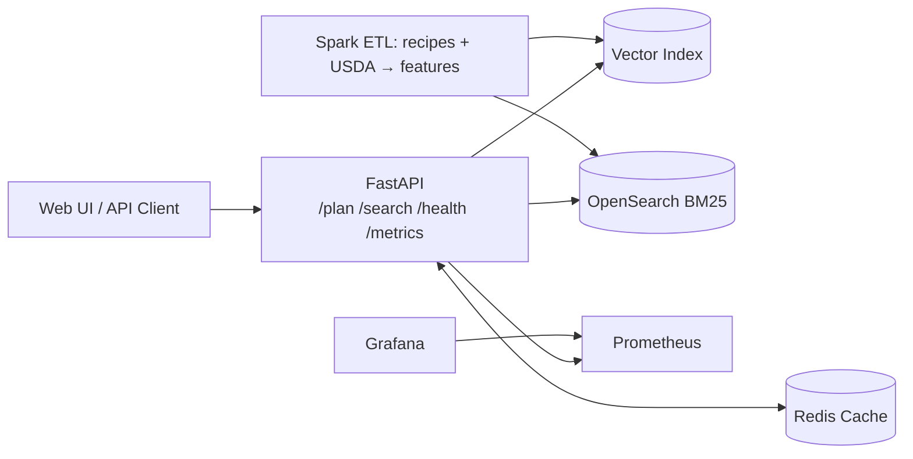

# Pantry-Aware Meal Planner (MLOps RAG)

**Pantry-aware recipe recommendations** with macro targets, substitution tips, and a **deduped grocery list**.  
Production-flavored stack: **FastAPI**, **Spark ETL**, **LangChain**, **Redis caching**, **Qdrant/OpenSearch**, **Prometheus/Grafana**, optional **OpenAI mini** for top-K explanations.

---

## ✨ Why this project?
Chat assistants can suggest recipes—but they don’t know your **pantry**, **macro goals**, or create a **grocery list** that minimizes new purchases.  
This app keeps **persistent pantry state**, performs **hybrid search** (BM25 + vectors), scores recipes by **pantry coverage + macros**, and explains **substitutions**.

---

## 📌 Features (MVP)
- **Plan meals from your pantry** with protein/calorie targets
- **Hybrid retrieval**: BM25 (OpenSearch) + embeddings (Qdrant)
- **Pantry coverage scoring** + macro fit (protein ↑, kcal ≤ cap)
- **Substitution tips** (template or OpenAI mini, cached)
- **Grocery list**: deduped, grouped (produce/meat/pantry)
- **API-first** (FastAPI) + **metrics** (`/metrics`) + **health** (`/health`)
- **Dev stack in Docker** (Redis, Qdrant, OpenSearch, Prometheus, Grafana)
- **CI** (GitHub Actions) and **local ETL** (Spark)

---

## 🗺️ Architecture (high level)


---

## 🚀 Quickstart

```bash
# python env
python -m venv .venv && source .venv/bin/activate
pip install -r requirements.txt

# bring up dev infra (Redis, Qdrant, OpenSearch, Prometheus, Grafana)
make up

# run API locally (hot reload)
make api
# Open: http://localhost:8000/docs and http://localhost:8000/metrics
```

**Seed sample data & ETL**

1. Put a small recipe JSON under `data/raw/recipes/` and a simple USDA CSV under `data/raw/usda/`.
2. Run:

```bash
make spark-etl
```

Outputs go to `data/processed/{recipes,usda_lookup,recipes_enriched}`.

---

## 🔧 Configuration

* **Configs:** `configs/dev.yaml`
* **Environment:** `.env` (copy from `.env.example`)
* **Key flags:**

  * `features.paid_explanations`: enable OpenAI mini for short tips
  * `features.cache_ttl_seconds`: Redis TTL for responses
  * `indexes.qdrant_url`, `indexes.opensearch_url`

---

## 📚 Data Sources (free/offline)

* **Recipes:** RecipeNLG / OpenRecipes JSON/CSV

* **Nutrition:** USDA (simplified CSV per 100g: calories, protein_g, fat_g, carbs_g)

> Licensing: keep dataset licenses in mind; attribute sources as required.

---

## 🧪 API (MVP)

**POST `/plan/meals`**

```json
{
  "pantry": ["tofu","garlic","pork shoulder"],
  "targets": {"protein_g_min": 30, "kcal_max": 650},
  "days": 3,
  "servings": 2,
  "avoid": ["peanut"],
  "prefer": ["tofu","kimchi"]
}
```

**Response (example)**

```json
{
  "recipes": [
    {
      "id":"r123",
      "title":"Spicy Tofu Stir-Fry",
      "time_minutes":20,
      "macros":{"kcal":520,"protein_g":32},
      "pantry_coverage":0.8,
      "why":"Uses tofu/garlic you have and meets protein target.",
      "missing":["soy sauce"]
    }
  ],
  "grocery_list":[{"item":"soy sauce","qty":"200ml","aisle":"pantry"}]
}
```

Also:

* **GET `/health/`** → `{ "ok": true }`
* **GET `/metrics`** → Prometheus metrics

---

## 🏗️ Project Structure

```
src/
  api/
    main.py               # FastAPI app (/plan, /health, /metrics)
    controllers/          # route handlers
    services/             # rag logic, embedder, cache, explain
  pipelines/spark/jobs/   # etl_recipes.py, etl_usda.py, features_join.py
  monitoring/             # prometheus metrics
infra/docker/             # docker-compose, prometheus, grafana
configs/                  # dev.yaml
data/                     # raw + processed
.github/workflows/        # ci-cd.yml
```

---

## 🧠 Roadmap

* [ ] Ranker: pantry coverage + macro fit + hybrid relevance (RRF)
* [ ] Redis cache (keyed by pantry+targets, TTL 10–60m)
* [ ] Qdrant + OpenSearch indexing from ETL outputs
* [ ] Substitution tips via LangChain (optional OpenAI mini)
* [ ] Grocery list grouping by aisle & quantities
* [ ] Simple UI (Streamlit or Next.js PWA)
* [ ] Grafana dashboard: latency p50/p95/p99, cache hit-rate
* [ ] CI: pytest, lint, build, (optional) deploy

---

## 🛡️ Monitoring

* **Prometheus** scrape: `/metrics`
* **Grafana** (dev): [http://localhost:3000](http://localhost:3000) (default admin/admin)
* Metrics:

  * `api_latency_seconds` (histogram by route)
  * `api_requests_total` (counter by route/status)

---

## 🧰 Development

```bash
# make targets
make up           # start docker services
make down         # stop & remove volumes
make api          # run FastAPI locally
make spark-etl    # run ETL pipeline
```

**Commit & push**

```bash
git add .
git commit -m "docs: add README and scaffold"
git push -u origin main
```


---

## 💬 About This Project
This project was developed as part of my self-learning journey to deepen hands-on skills in ML/GenAI and real-world MLOps by building something I’ll actually use every day: a pantry-aware meal planner.

With ChatGPT/Codex as a pair-programming assistant, I designed and implemented this project from scratch—covering Spark ETL for recipes + nutrition, hybrid retrieval (BM25 + embeddings), FastAPI service design, caching/monitoring, and optional GPT-mini explanations for substitutions. The goal is to turn abstract concepts (RAG, ranking, metrics, CI/CD, containerization) into a production-flavored, reusable framework for practical GenAI applications.

> 🧭 This project is part of my ongoing exploration in AI/ML system design and Generative AI engineering—particularly **retrieval**, **personalization**, **observability**, and **cost-aware LLM integration**.

---

## 🙏 Acknowledgments

* Recipe datasets: RecipeNLG/OpenRecipes (licenses vary)
* Nutrition data: USDA FoodData Central (simplified)
* Infra: Qdrant, OpenSearch, Redis, Prometheus, Grafana

## 🪪 License

This project is licensed under the MIT License.
